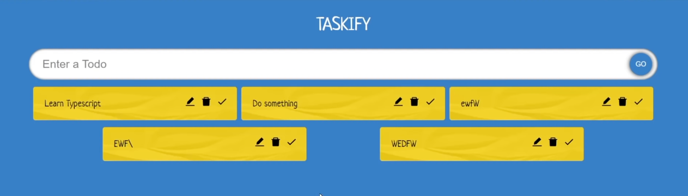
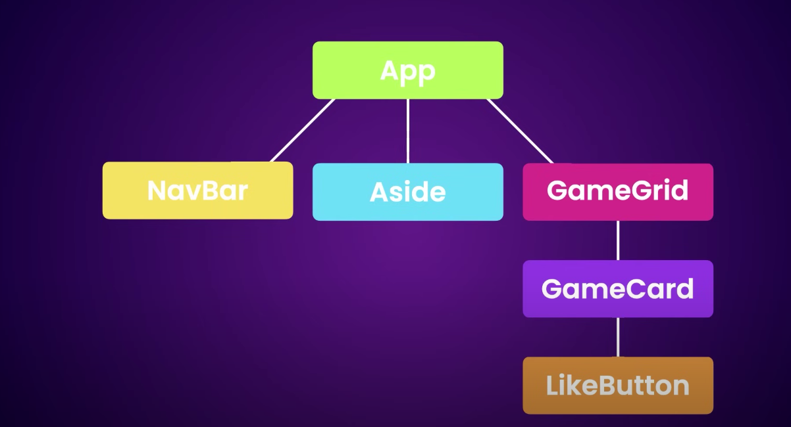
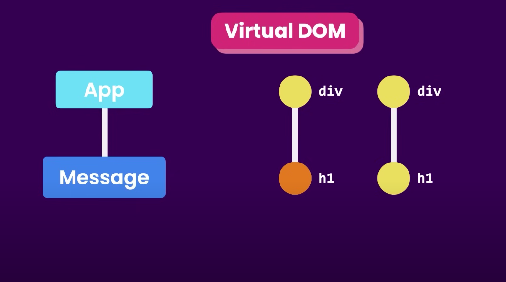

# Taskify

Sample react project for study purpose.
create, delete, update tasks

## Useful links

- https://react.dev/learn
- https://react.dev/learn/describing-the-ui
- https://roadmap.sh/react
- https://www.youtube.com/watch?v=FJDVKeh7RJI&t=10s
- https://www.youtube.com/watch?v=SqcY0GlETPk&t=1s

## Dev env setup

- Node > 16
- Vsc extensions
- Prettier - After install, Settings>Format On Save (on)
- Dev tool for browsers - https://react.dev/learn/react-developer-tools

# How React Outstands

- As DOM (document object model is a tree base object), allows JS to manipuate view, thus how the react framework took it's place.
- React use virtual dom for rendering, that change the only DOM tree that updated, works like Trigger->Render->Commit, after this browser loads view "Painting".

# Development

- Create with "Create React App" (CRA), https://create-react-app.dev/docs/getting-started.
- Alternatively "Vite". Since Vite is faster and create only smaller bundle sizes. `npm create vite@latest` or `npm create vite@version-number`, we need give specific version-number.
- Enter the other details, and maybe use SWC (stands for Speedy Web Compiler), Vite + SWC has the fastest run time.
- Now run:
  cd taskify
  npm install / npm i
  npm run dev (to run local server)

## Project structure

- node_modules: all third party libraries are installed.
- public : all public assets exists.
- src: src file
  - main.tsx: entry point for app, the component specified <React.StrictMode></React.StrictMode> check the potential problems. `ReactDOM` libary use in web app and in mobile the `ReactNative` library.
  - App.tsx: current root component on creation.
  - .eslintrc.cjs : Eslint configs
- index.html: entry point for our app defined (usually main.tsx), div with id "root" is container of app.
- package.json: infomation about dependency, build, project etc..
- tsconfig.json: typescript config, instruction on how to compile to js (can be auto construct with cmd in normal projects)
- vite.config.json: vite config files

## Components

- We use `tsx` extension for react TS component file (Message.tsx).
- Best practice to create
- Class component (Before React 16.8, Class components were the only way to track state and lifecycle on a React component.)
- Now it is easy to create functions as components.
- Components helps to create reusable, modular codes.
- Treat each boxes as components, and each subboxes in view as it's child components.

## JSX

    - We use JSX(Javascript XML), as the component render syntax. That is whatever returned in the component.
    - Online converter html to JSX (https://transform.tools/html-to-jsx)
    - Convertion of JSX to JS can see in https://babeljs.io/rep.
    - JSX is very stricter tahn normal html, the return of component can't return multiple elements it should contained in a 

 or a wrapper <></>.
    - And every tag should closed even self closed (refer Message.tsx or App.tsx).

### JSX with curly braces

    - It is possible to pass any JS expressions in curly braces {}, that is a piece of code that returns value, eg: variable, function etc.

### Conditional Rendering

    - We can use if/else, ternary operator (? :) and logical AND ( && ).

## How React Working & Vite auto adapt the changes

- Auto render changes by monitoring the comonents with the hot module replacement (hmr).

  2:20:11 AM [vite] hmr update /src/App.tsx (x4)

  2:25:23 AM [vite] hmr update /src/App.tsx (x5)

- React build virtual DOM that is an in memory representation of the components and properties (like a tree). The react identify the node updated and check the changes and update DOM with library called React DOM (check on dependencies "react" and "react-dom").

### State (useState Hook)

- State is a component's memory.
- You can read state at any time. However, each render has its own snapshot of state which does not change.
- The useState Hook provides those two things:

  A state variable to retain the data between renders.
  A state setter function to update the variable and trigger React to render the component again.

- State will remember something on component's memory, even after a DOM refresh.

- Our application refresh everytime since the parent component have `task` & `tasks` state. It updates on every entry in input field and every add of tasks.

            const [task, setTask] = useState<string>("");
            const [tasks, pushStacks] = useState<Task[]>([]);

             const addTasks = (event: React.FormEvent) => {
                  // prevent the page refresh
                  event.preventDefault();
                  if (task) {
                        recentTaskUid = `${Date.now().toString()}-${task}`;
                        pushStacks([...tasks, {id: `${recentTaskUid}`,taskName:task}]);
                        // empty the input after add
                        setTask("");
                  }
                  };

### useState with Array

- We can't directly append array data, https://react.dev/learn/updating-arrays-in-state.
- Same applicable for removing, update, replace array items.
- Like with objects, you should treat arrays in React state as read-only. This means that you shouldn’t reassign items inside an array like arr[0] = 'bird', and you also shouldn’t use methods that mutate the array, such as push() and pop().

### Passing Props to a Component

- React components use props to communicate with each other. Every parent component can pass some information to its child components by giving them props.
- We can pass any JS values in props to react the child.

### Spread Operator (...) usage in passing props

- It is very useful to create the ts constant variable with the props data need to pass in components.
- Reference `App.tsx` file.

      let inputProps: TaskState = {task: task, setTask: setTask, addTasks: addTasks};
      <InputField {...inputProps}/>

### Forwarding props with the JSX spread syntax

- We can pass the props as spread operator eg: `<Avatar {...props} />` and `Profile({ person, size, isSepia, thickBorder })`, check `App.tsx`.

### How to read values from child to parent

- We can add some state from parent and pass it to the child, and read some data from it.

### Responding to Events

- To add an event handler, you will first define a function and then pass it as a prop to the appropriate JSX tag.
- Get realtime data from child, eg: Input child give data to parent state variable,

      <input type="text" placeholder="Enter the task" value={inputProps.task} onChange={(event)=> InputOnchange(event, inputProps.setTask)} className="inputField"/>

      function InputOnchange(event: React.ChangeEvent<HTMLInputElement>, setTask: React.Dispatch<React.SetStateAction<string>>){

      setTask(event.target.value)}

### Event propagation (event bubbling)

- We use `e.stopPropagation()` to stop this issue. Ref: https://react.dev/learn/responding-to-events#stopping-propagation

### Preventing default behavior

- We can call `e.preventDefault()` on the event object to stop this from happening.
- This is usually useful in Form element etc.. Ref: https://react.dev/learn/responding-to-events#preventing-default-behavior
- In `InputField.tsx` file we implemented the onSumbit handler, by passing the event reference on callback function.
- We thus prevent the page refresh.

## Referencing Values with Refs (useRef Hook)

- You can add a ref to your component by importing the useRef Hook, will act as a state permanently holded for that component. (https://react.dev/learn/referencing-values-with-refs)
- Doesn’t trigger re-render when you change it.
- You can access the current value of that ref through the ref.current property. This value is intentionally mutable, meaning you can both read and write to it. It’s like a secret pocket of your component that React doesn’t track.

      const inputFieldActive = useRef<HTMLInputElement>(null);

      <form className="addTask" onSubmit={(event)=> HandleSubmit(inputProps, event, inputFieldActive)}>
        <input ref={inputFieldActive}/>

      inputFieldActive.current?.blur();

      Since the `ref` is an HTMLInputElement, we have access to properties on DOM attributes (https://react.dev/learn/manipulating-the-dom-with-refs).

## Rendering Lists (state Lists)

- Lists can be rendered using js default utility functions `map() or filter()`. (https://react.dev/learn/rendering-lists)
- Rendered in a elements with data in curly bracket `{}`. (`<li>{task.taskName}</li>`)
- Reference `TaskList.tsx`.

        const tasksListDom = tasksList.tasks.map(task => <li>{task.taskName}</li>);

  CONSOLE WARNING: `Warning: Each child in a list should have a unique “key” prop.`

  You need to give each array item a `key` — a string or a number that uniquely identifies it among other items in that array

  Keys tell React which array item each component corresponds to, so that it can match them up later. This becomes important if your array items can move (e.g. due to sorting), get inserted, or get deleted. A well-chosen key helps React infer what exactly has happened, and make the correct updates to the DOM tree.

      <li key={person.id}>...</li>

## Passing Data Deeply with Context (useContext)

- Context are meant to store any kind of data, which can be accessible by any of the components without passing as `props`, no matter in which position they are in the tree.
- This eliminates the passing of pop drilling (long chain of props passing through component tree).
- It is a common sharing state can be accessible by any components in application, Global data for entire application.

https://www.youtube.com/watch?v=HYKDUF8X3qI

Here in the application we have implemented the tasks state as context.
Steps:

- Created a context for tasks and the wrapped the context with all other components. Reference `ApplicationContext.ts`.

      export const ApplicationTaskContext = createContext<Task[] | undefined>(undefined);

- We usually initialize context with `undefined | null`, since we are assigning value after the application initialize.
- Wrap the components inside a context.

      <ApplicationTaskContext.Provider value={tasks}>

      and we pass a value to initialize

- We can use the context in any components without passing it in props. Reference- `TaskList.tsx`.

      const tasks = useContext(ApplicationTaskContext);

- Alternative to check the context have value or not, since context have `undefined | null` intial value, with typescript conditions like below.

      if (tasks) {
      tasksListDom = tasks.map(task => <li key={task.id}>{task.taskName}</li>)
      }

  We can create a `Custom Hook` that handles this.

## Custom Hook

- React supports for creating custom hooks for our own usecase.
- Here we use it for check the context have value or not. Reference - `ApplicationContext.tsx->useTaskContext()`.
- As a best practice we will throw error when the context is undefined (here it is task context). Else we return the context data, thus we validate and use the context using custom hooks.

      //custom hook for context data validation
      export function useTaskContext(){
      const tasks: Task[] | undefined = useContext(ApplicationTaskContext);
      if(tasks === undefined){
      throw new Error("UseTaskContext need to be used with initiliaze a value in context wrapper provider.");
      }

      return tasks;
      }

## Effect Hook (useEffect)

- Used to perform the side effect.
- Side effect are result of the state changing. When application goes with one state to other it cause a side effect and this can be controlled using the `useEffect`.
- The use is simply as an event listener of states in react application.
- The useEffect have 3 params

      useEffect(()=>{
        // The code that runs on that effect

        // optional return function
      }, []) // The dependency array optional, in which trigger statement added

- Dependency array is optional, if not provided the useEffect will not run the code.
- But even if dependency array is not provided the useEffect with run the code atleast one time, on mount.
- Dependency array can hold a variable

We used useEffect here to identify new taskCard with useRef on mount and remove that on data changes, with help of useState (that changes on second render), since the second useRef only works on mount time of component, like constructor of object.

            // custom hook usage for edit and delete
            const taskList: TaskListProp = useTaskContext();
            // this will set true since the useEffect constructor works on the component mounts to DOM
            const [isNewTask, setBackNewTask] = useState<boolean>(true);

            useEffect(()=>{
                  // The code that runs on that effect
                  if (isNewTask !== false) {
                        setBackNewTask(false);
                  }
                  // optional return function
            }, [taskList]); // The dependency array optional, in which trigger statement added

            useEffect(()=>{
                  setBackNewTask(true);
                  // optional return function
            }, []);

#### Usecases

- Synchronizing with Effects: useEffect run the code in every render
- Event handlers - Run code based on render dependency

            useEffect(() => {
            // This runs after every render since no dependecy defined
            });

            useEffect(() => {
            // This runs only on mount (when the component appears)
            }, []);

            useEffect(() => {
            // This runs on mount *and also* if either a or b have changed since the last render
            }, [a, b]);

- Clean up (Destructor) : When a dependency change, before the value is changed, since useEffect get destroyed on every change and do the logic in cleanup `return`. This will help to unsubscribe the things, like clear a timeout, clearInterval, or an event listener etc..

            useEffect(() => {
            // This runs on mount *and also* if either a or b have changed since the last render
            console.log(a);
            return()=>{
                  console.log("I am cleaned-up");
            }
            }, [a]);

- Component mount/unmount listener: If no dependency is added with empty array, it works on component mount (Constructor) and component unmount.

            useEffect(() => {
            // This runs on mount *and also* if either a or b have changed since the last render
            console.log(a);
            return()=>{
                  console.log("I am cleaned-up");
            }
            }, []);

## React Icons

- We use the react icons for the app icons.
- https://react-icons.github.io/react-icons/
- To use : npm install react-icons --save

      import { FaBeer } from 'react-icons/fa';

- In our case in `TaskCard.tsx`

      import { GrEdit } from 'react-icons/gr';

      And use: <GrEdit />
